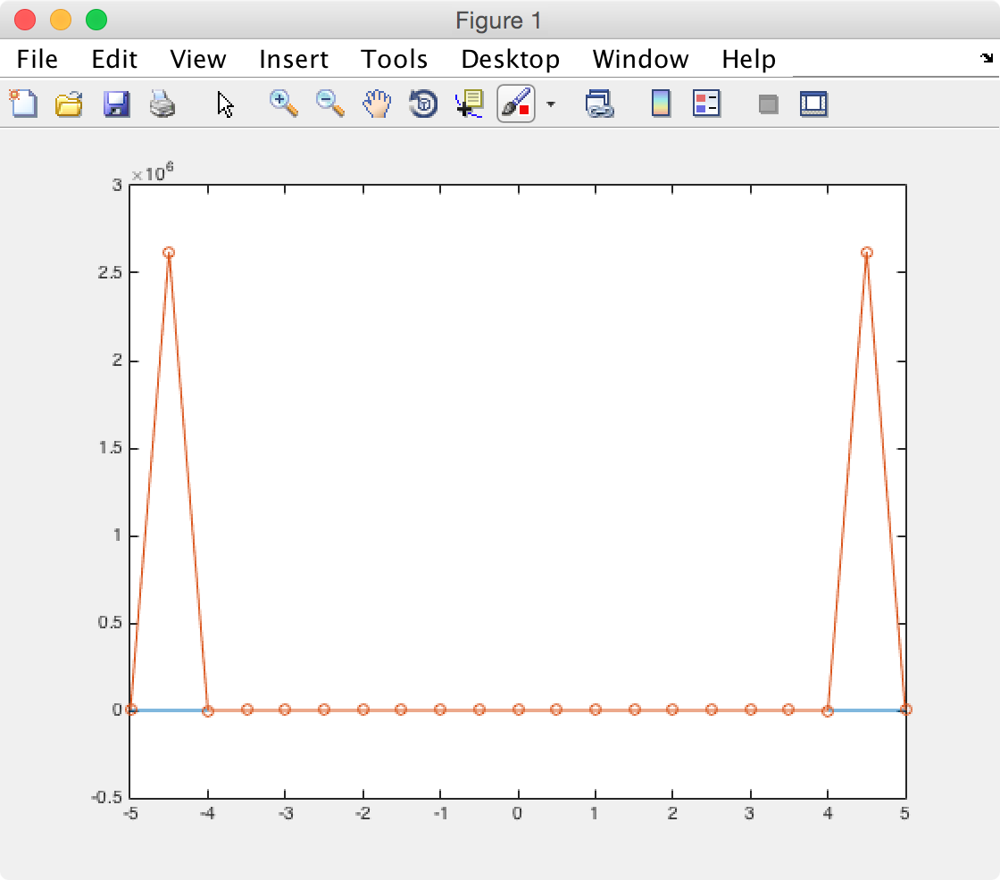
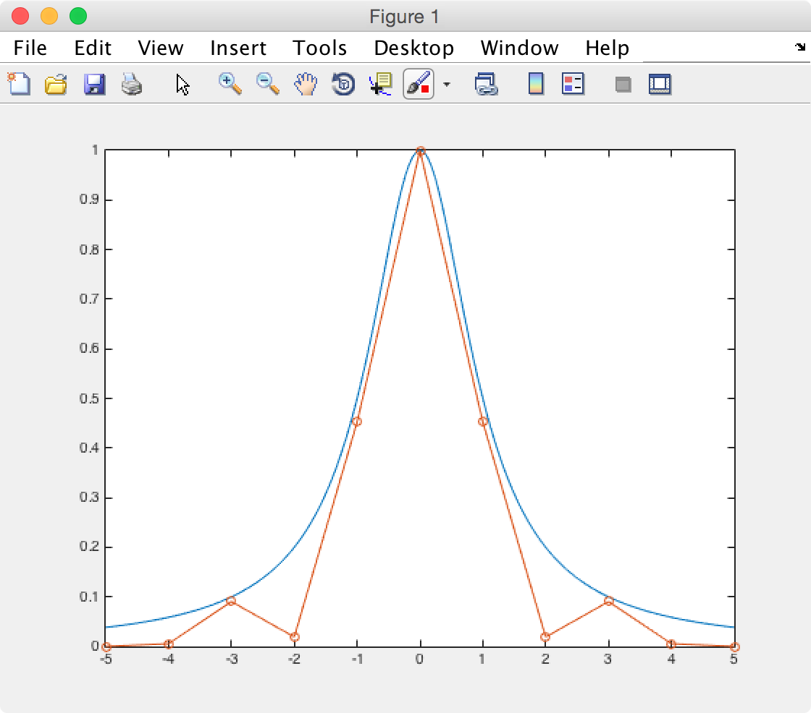

# Numerical Analysis Project 1

Andrew Kerr (me@andrewjkerr.com)

UFID: 1458-9233

## 1. Visual Inspection

### Plot


### Code

```matlab
>> x = [0:0.1:10];
>> plot(x, exp((-x / 5)));
>> hold on
>> plot(x, sin(x));
```

### Analysis

It appears that `sin(x)` is equal to `exp(-x / 5)` at the following points:

- 1
- 2.5
- 6.5
- 9.3

## 2. Midpoint Method

### Function Function

I defined a function with our f(x) in order to make it easier to deal with.

```matlab
function [f] = f(x)
    f = exp(-x/5) - sin(x);
end
```

### Midpoint Function

```matlab
function [steps, root] = bisection_method(a, b, tolerance)
    step = 0;
    midpoint = (a + b) / 2;
    midpoint_error = 1 + tolerance;
    
    while(midpoint_error > tolerance)
        previous_midpoint = midpoint;
        f_a = f(a);
        f_midpoint = f(midpoint);
        
        if f_a * f_midpoint < 0
            b = midpoint;
        elseif f_a * f_midpoint > 0
            a = midpoint;
        else
            break;
        end
        
        step = step + 1;
        midpoint = (a + b) / 2;
        midpoint_error = abs((midpoint - previous_midpoint) / midpoint);
    end

    root = midpoint;
    steps = step;
end
```

### Code

```
>> [steps, root] = bisection_method(0, 2, 10^-7)

steps =

    24


root =

    0.9683

>> [steps, root] = bisection_method(2, 3, 10^-7)

steps =

    21


root =

    2.4881

>> [steps, root] = bisection_method(6, 7, 10^-7)

steps =

    20


root =

    6.5561

>> [steps, root] = bisection_method(9, 10, 10^-7)

steps =

    20


root =

    9.2674
```

### Analysis

My function found the following roots:

- 0.9683 (24 steps)
- 2.4881 (21 steps)
- 6.5561 (20 steps)
- 9.2674 (20 steps)

## 3. Newton's Method

### Derivative Function Function

I defined a function with our f'(x) in order to make it easier to deal with.

```matlab
function [f] = f_prime(x)
    f = ((-1/5) * exp(-x/5)) - cos(x);
end
```

### Newton's Method Function

```matlab
function [steps, root] = newtons_method(a, tolerance)
    steps = 0;
    root = a;
    root_error = tolerance + 1;
    
    while(root_error > tolerance)
        steps = steps + 1;
        old_root = root;
        root = old_root - (f(old_root) / f_prime(old_root));
        root_error = abs((root - old_root) / root);
    end
end
```

### Code

```
>> [steps, root] = newtons_method(0, 10^-7)

steps =

     5


root =

    0.9683

>> [steps, root] = newtons_method(2, 10^-7)

steps =

     5


root =

    2.4881

>> [steps, root] = newtons_method(6, 10^-7)

steps =

     4


root =

    6.5561

>> [steps, root] = newtons_method(9, 10^-7)

steps =

     4


root =

    9.2674
```

### Analysis

My function found the following roots:

- 0.9683 (5 steps)
- 2.4881 (5 steps)
- 6.5561 (4 steps)
- 9.2674 (4 steps)

Newton's method is much faster than the midpoint method because, even though they both found the same roots, Newton's method took far less steps than the midpoint method.

## Newton's Method Part 2

### Function Function

I defined a function with our f(x) in order to make it easier to deal with.

```matlab
function [f] = f(x)
    f = (x - 3)^4 * sin(x);
end
```

### Derivative Function Function

I defined a function with our f'(x) in order to make it easier to deal with.

```matlab
function [f] = f_prime(x)
    f = (-3 + x)^3 * ((-3 + x) * cos(x) + 4 * sin(x));
end
```

### Altered Newton's Method Function

```matlab
function [steps, root] = altered_newtons_method(a, tolerance, order)
    steps = 0;
    root = a;
    root_error = tolerance + 1;
    
    while(root_error > tolerance)
        steps = steps + 1;
        old_root = root;
        root = old_root - order * (f(old_root) / f_prime(old_root));
        root_error = abs((root - old_root) / root);
    end
end
```

### Code

```
>> [steps, root] = newtons_method(2, 10^-7)

steps =

    51


root =

    3.0000

>> [steps, root] = altered_newtons_method(2, 10^-7, 4)

steps =

     5


root =

    3.0000
```

### Analysis

Newton's method and altered Newton's method found a root at 3.0000. However, altered Newton's method was much faster than Newton's method. This is due to Newton's method having a *linear* rate of convergence while altered Newton's method has a *quadratic* rate of convergence.

## 5. Lagrange Interpolation

### Lagrange Interpolation Function

```matlab
function [v] = lagrange_interpolation(x, y, u)
    n = length(x);
    v = zeros(size(u));
    
    for i = 1:n
        w = ones(size(u));
        for j = [1:(i - 1) (i + 1):n]
            w = (u - x(j)) ./ (x(i) - x(j)) .* w;
        end
        v = v + w * y(i);
    end
end
```

### Order n = 5

```
>> x = [-5:0.01:5];
>> x1 = linspace(-5, 5, 6);
>> y = 1 ./ (1 + x.^2);
>> interpolation = lagrange_interpolation(x, y, x1);
>> plot(x, y, x1, interpolation, '-o');
```


### Order n = 10

```
>> x = [-5:0.01:5];
>> x1 = linspace(-5, 5, 11);
>> y = 1 ./ (1 + x.^2);
>> interpolation = lagrange_interpolation(x, y, x1);
>> plot(x, y, x1, interpolation, '-o');
>> axis([-3, 3, 0, 1])
```


_Full_


_Zoomed_


### Order n = 20

```
>> x = [-5:0.01:5];
>> x1 = linspace(-5, 5, 21);
>> y = 1 ./ (1 + x.^2);
>> interpolation = lagrange_interpolation(x, y, x1);
>> plot(x, y, x1, interpolation, '-o');
>> axis([-4, 4, 0, 1])
```


_Full_


_Zoomed_

### Analysis

As the order n increases, the approximation does get better if you look at the zoomed in version. However, while the approximation near the maximum does get better with an increasing order, the approximation on the outside edges is much much worse. Also, digging into it a little more, it appears that the approximation on the outside edges with higher orders does get better if the number of points in `y` is decreased.

## 6. Piecewise Linear Interpolation

### Order n = 5

```
>> x = [-5:0.01:5];
>> y = 1 ./ (1 + x.^2);
>> x1 = linspace(-5, 5, 6);
>> interpolation = interp1(x, y, x1);
>> plot(x, y, x1, interpolation, '-o');
```


### Order n = 10

```
>> x = [-5:0.01:5];
>> y = 1 ./ (1 + x.^2);
>> x1 = linspace(-5, 5, 11);
>> interpolation = interp1(x, y, x1);
>> plot(x, y, x1, interpolation, '-o');
```


### Order n = 20

```
>> x = [-5:0.01:5];
>> y = 1 ./ (1 + x.^2);
>> x1 = linspace(-5, 5, 21);
>> interpolation = interp1(x, y, x1);
>> plot(x, y, x1, interpolation, '-o');
```


### Analysis

Yes, the approximation does get better as order increases! And, unlike the Lagrange interpolation, the approximation does get better everywhere.

## 7. Raised Cosine Interpolation

### Order n = 5

```
>> x = [-5:0.01:5];
>> y = 1 ./ (1 + x.^2);
>> x1 = linspace(-5, 5, 6);
>> y1 = 1 ./ (1 + x1.^2);
>> x_rc = linspace(-pi, pi, 6);
>> rc = (1 + cos(x1 .* x_rc)) ./ 2;
>> interpolation = y1 .* rc;
>> plot(x, y, x1, interpolation, '-o');
```


### Order n = 10

```
>> x = [-5:0.01:5];
>> y = 1 ./ (1 + x.^2);
>> x1 = linspace(-5, 5, 11);
>> y1 = 1 ./ (1 + x1.^2);
>> x_rc = linspace(-pi, pi, 11);
>> rc = (1 + cos(x1 .* x_rc)) ./ 2;
>> interpolation = y1 .* rc;
>> plot(x, y, x1, interpolation, '-o');
```



### Order n = 20

```
>> x = [-5:0.01:5];
>> y = 1 ./ (1 + x.^2);
>> x1 = linspace(-5, 5, 21);
>> y1 = 1 ./ (1 + x1.^2);
>> x_rc = linspace(-pi, pi, 21);
>> rc = (1 + cos(x1 .* x_rc)) ./ 2;
>> interpolation = y1 .* rc;
>> plot(x, y, x1, interpolation, '-o');
```


### Analysis

The raised cosine interpolation, like the Lagrange interpolation, does have a better approximation near the maximum as order is increased. However, the edges of the raised cosine interpolation does not provide as good of an approximation as the piecewise linear interpolation does.

## 8. Least Squares Approximation

### Order n = 5

```
>> x = [-5:0.01:5];
>> y = 1 ./ (1 + x.^2);
>> coefficients = polyfit(x, y, 5);
>> interpolation = polyval(coefficients, x);
>> plot(x, y, x, interpolation);
```


### Order n = 10

```
>> x = [-5:0.01:5];
>> y = 1 ./ (1 + x.^2);
>> coefficients = polyfit(x, y, 10);
>> interpolation = polyval(coefficients, x);
>> plot(x, y, x, interpolation);
```


### Order n = 20

```
>> x = [-5:0.01:5];
>> y = 1 ./ (1 + x.^2);
>> coefficients = polyfit(x, y, 20);
>> interpolation = polyval(coefficients, x);
>> plot(x, y, x, interpolation);
Warning: Polynomial is badly conditioned. Add points with distinct X values, reduce the
degree of the polynomial, or try centering and scaling as described in HELP POLYFIT. 
> In polyfit (line 75) 
```


### Analysis

The least squares approximation does get better with more points. It also seems to have the best higher order approximation out of any of the other approximations. However, it appears that the lower order approximations are not very accurate when comparing them to the other approximations.
